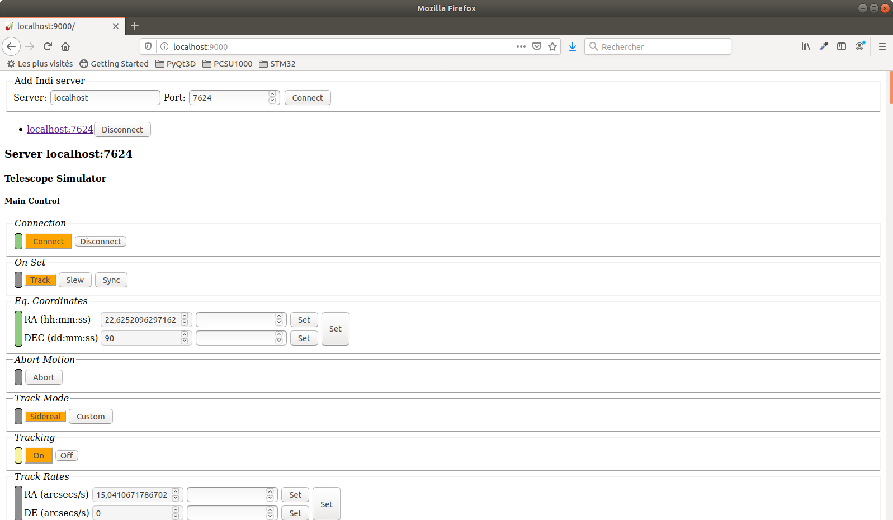
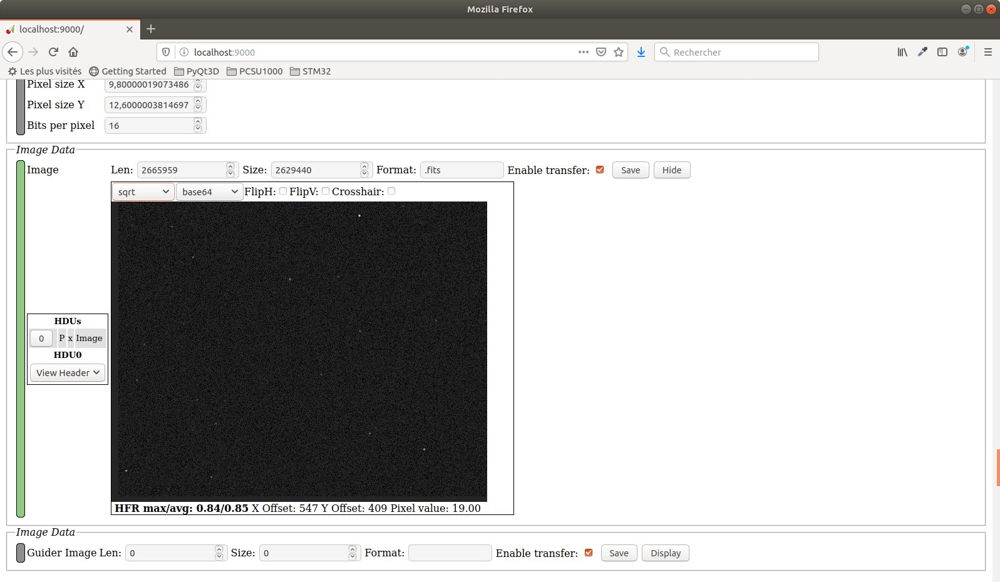

# pyindi-ws : Python webserver for Indi

`pyindi-ws` is a simple webserver that presents an Indi client interface in a browser.
It is based on `pyindi-client` for the Indi side and on `cherrypy` and `ws4py` for the websocket side.

 ### Install and run the webserver
* First install the requirements (besides Python and Indi):
```
pip3 install --user pyindi-client
pip3 install --user cherrypy
pip3 install --user ws4py
```
* download an archive or clone the repository
* run the server from the directory where you cloned/downloaded the repository
```
python3 indi_simple_html_cherrypy_server.py
```
* you can run a browser and connect to `localhost:9000`

Here are some screenschots: the simple (and unique) html  page



and the part with a fits image displayed with `astroview` js plugin

 


##### A small note (for myself):
To run `gsc` from a custom directory, use the following shell script:
```
export GSCBIN=/opt/gsc/bin
export GSCDAT=/opt/gsc/
/opt/gsc/src/gsc.exe $@

```
Chmod 755 and Copy it to `/usr/bin/gsc`. If you recompile `gsc` from source:
```
cd /opt/gsc/bin
mv gsc.exe gsc.exe.orig
mv decode.exe decode.exe.orig
ln -s /opt/gsc/src/gsc.exe .
ln -s /opt/gsc/src/decode.exe .
```
